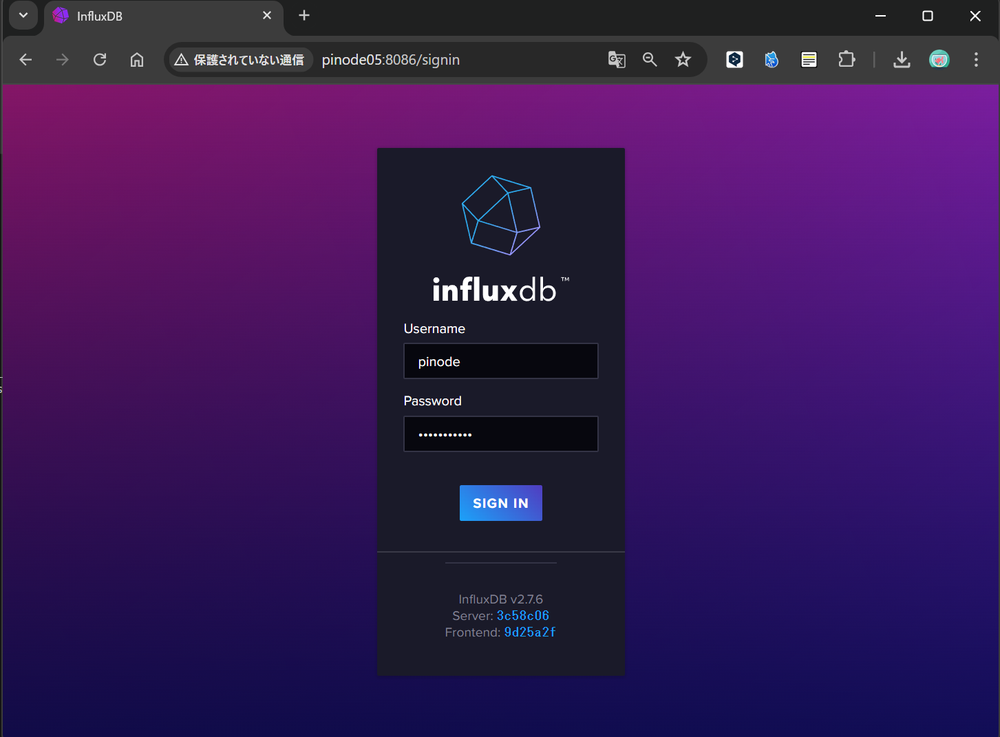
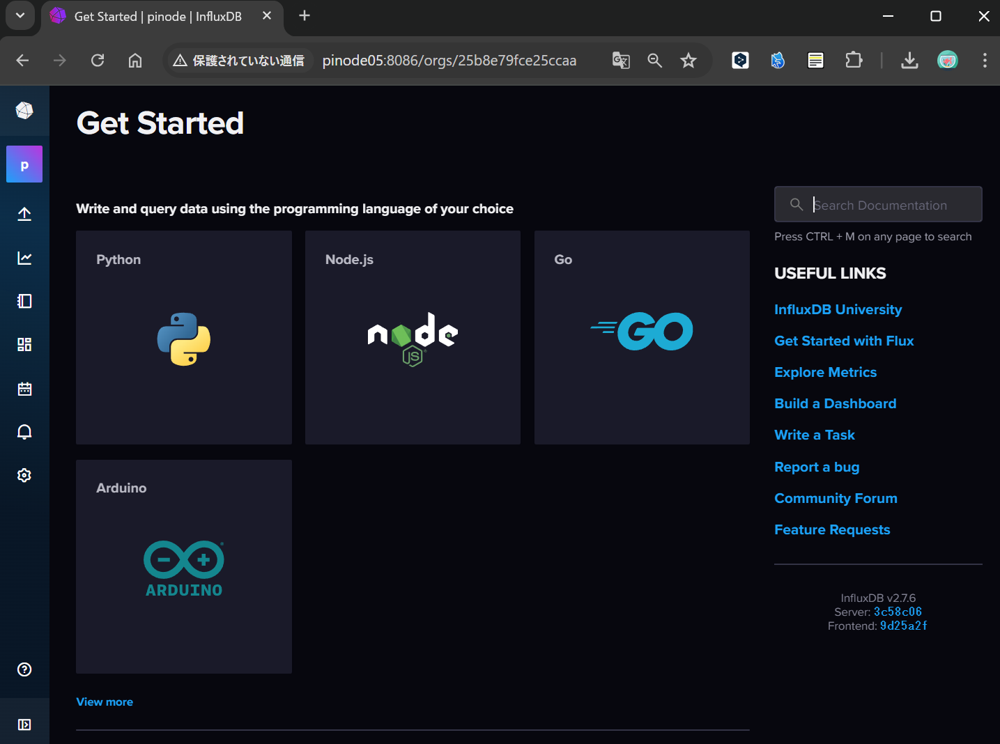
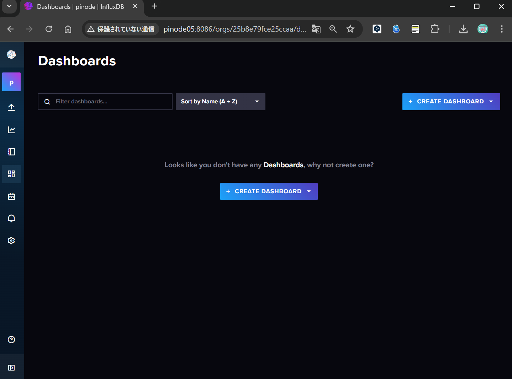
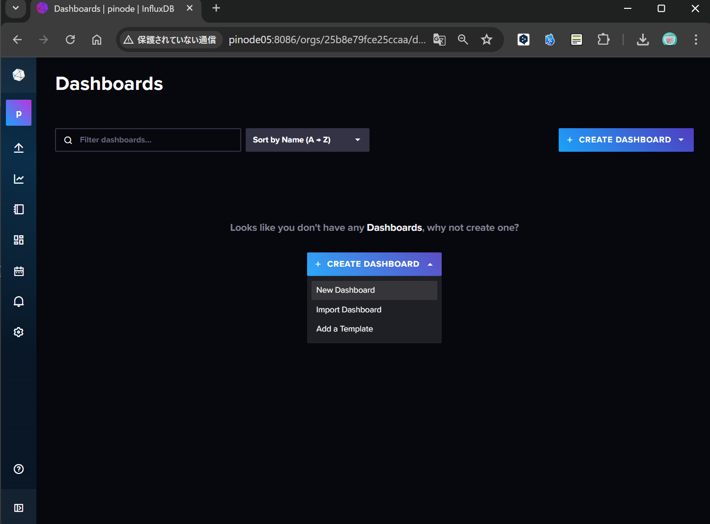
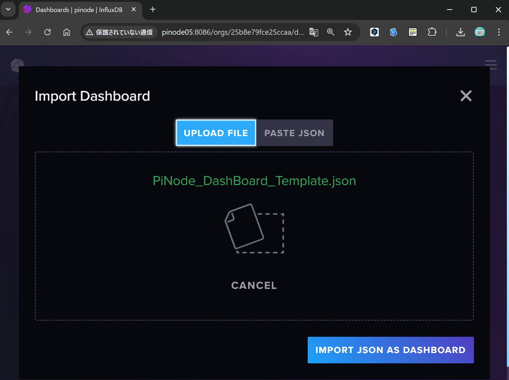
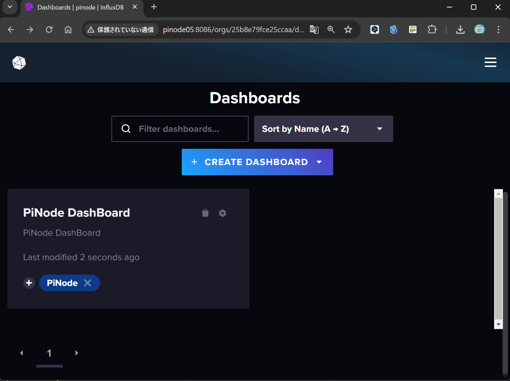
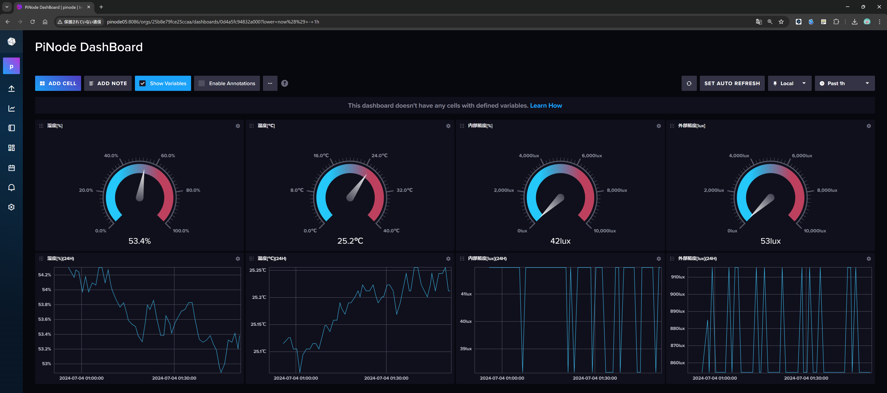

# PiNode DashBoard設定方法

このチャプターではPiNode内で保存されているInfluxDBのデータをリアルタイムで監視するためのダッシュボードを作成するための方法を説明します。

## InfluxDBへのアクセス

以下のアドレスにアクセス後、ログイン

```
URL : http://[PiNodeIPアドレス or PiNodeホスト名]:8086(本例ではpinode05でアクセスを行っている)
Username : 設定ユーザ名(default : pinode)
Password : 設定パスワード(default : pinode-pass)
```



アクセス後GetStartedの画面が出てくればOK



## DashBoardの作成

左下のDashBoardのアイコンからDashboardの画面に移動



CreateDashBoardボタンを押すことで[Import Dashboard]ボタンが出てくる為これをクリックする


そうすると、ダッシュボードのテンプレをアップロードできるため
```notebooks/PiNode_DashBoard_Template.json```ファイルをドラッグ&ドロップし、
```IMPORT JSON AS DASHBOARD```でアップロードを行う


PiNode DashBoardが作成されれば完了である。


## DashBoardの見方

左から温度・湿度・内部照度・外部照度が表示されている
上段は現在の環境値、下段は24時間の環境値変化を表示している

また、上段は数値がどれだけ大きいかを表すことができるようになっている。
こうすることで現在の環境値が適正かどうかを瞬時に確認することが可能である。
